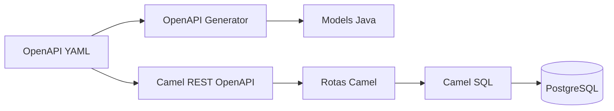
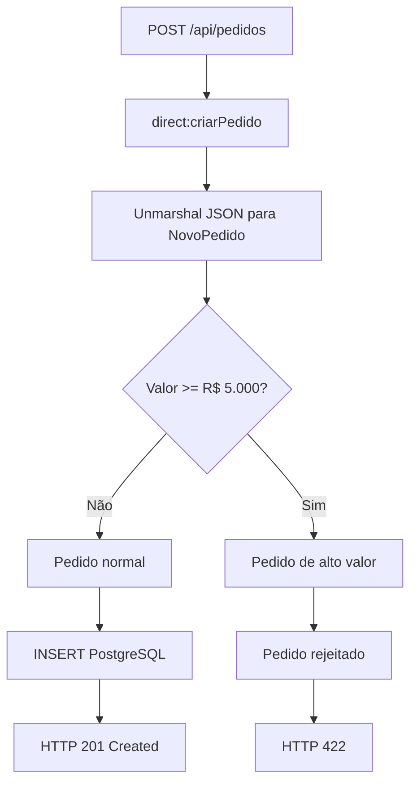
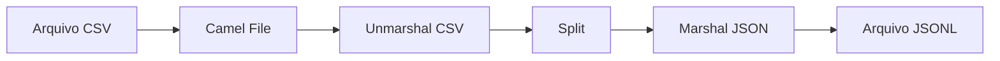
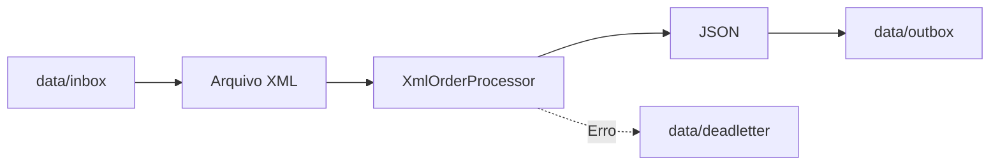
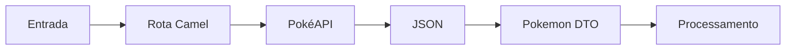

# Apache Camel — Integrações, EIPs e API Contract-First

Projeto desenvolvido durante meus estudos de **Apache Camel**, com foco na construção de rotas de integração, aplicação de **Enterprise Integration Patterns (EIPs)** e desenvolvimento de APIs utilizando a abordagem **Contract-First / API-First com OpenAPI**.

O repositório reúne exemplos práticos que evoluem desde rotas simples de transformação de arquivos até uma API REST com CRUD, persistência em PostgreSQL, geração de modelos a partir do contrato OpenAPI, tratamento de erros e testes automatizados.

O objetivo do projeto é consolidar conceitos de integração de sistemas utilizando **Java, Spring Boot e Apache Camel**, aplicando padrões próximos aos encontrados em aplicações corporativas.

---

## Tecnologias


Principais tecnologias e ferramentas utilizadas:

- Java 21
- Spring Boot
- Apache Camel
- Maven
- OpenAPI 3
- OpenAPI Generator
- PostgreSQL
- Docker
- Jackson
- Camel SQL
- Camel REST OpenAPI
- Camel Platform HTTP
- Camel File
- Camel CSV
- Camel HTTP
- XPath
- JUnit 5
- Camel Test
- MockEndpoint

---

## Objetivos do projeto

O projeto foi estruturado para estudar e demonstrar, de forma prática:

- criação de rotas de integração com Apache Camel;
- transformação de mensagens entre diferentes formatos;
- consumo e exposição de APIs REST;
- desenvolvimento de APIs utilizando **Contract-First**;
- persistência de dados utilizando Camel SQL e PostgreSQL;
- aplicação de Enterprise Integration Patterns;
- tratamento de exceções, redelivery e Dead Letter Channel;
- roteamento baseado no conteúdo da mensagem;
- integração com APIs externas;
- processamento assíncrono;
- testes automatizados de rotas Camel.

---

# Arquitetura da API de Pedidos

Uma das principais implementações do projeto é uma API REST para gerenciamento de pedidos utilizando a abordagem **Contract-First**.

O contrato OpenAPI funciona como fonte de verdade da API.



O fluxo permite separar claramente:

- contrato da API;
- modelos de dados;
- regras de roteamento;
- integração;
- persistência.

---

## Contract-First com OpenAPI

O contrato da API é definido em:

```text
src/main/resources/openapi/pedidos-api.yaml
```

A partir dele, o **OpenAPI Generator** gera os modelos Java utilizados pela aplicação.

Entre os modelos utilizados estão:

```text
NovoPedido
Pedido
ErroPedido
```

O Camel utiliza os `operationId` definidos no contrato para encaminhar as requisições para rotas internas.

Exemplo:

```yaml
operationId: criarPedido
```

é associado ao endpoint Camel:

```java
from("direct:criarPedido")
```

Dessa forma, o contrato OpenAPI permanece alinhado à implementação da API.

---

# API de Pedidos

A API implementa operações CRUD para gerenciamento de pedidos.

| Método | Endpoint | Descrição |
|---|---|---|
| `POST` | `/api/pedidos` | Cria um pedido |
| `GET` | `/api/pedidos` | Lista os pedidos |
| `GET` | `/api/pedidos/{id}` | Busca um pedido |
| `PUT` | `/api/pedidos/{id}` | Atualiza um pedido |
| `DELETE` | `/api/pedidos/{id}` | Exclui um pedido |

A persistência é realizada em **PostgreSQL utilizando o componente Camel SQL**.

---

# Content-Based Router

A criação de pedidos também utiliza o padrão **Content-Based Router**, implementado através do DSL:

```java
.choice()
    .when(...)
    .otherwise()
.end()
```

Nesse exemplo, pedidos são classificados de acordo com o valor informado.



A condição é avaliada utilizando **Camel Simple Language**:

```java
.when(simple("${body.getValor()} >= 5000"))
```

Pedidos abaixo do limite seguem o fluxo normal de persistência.

Pedidos de alto valor são direcionados para:

```text
direct:pedidoAltoValor
```

e não são persistidos.

A API retorna:

```text
HTTP 422 - Unprocessable Content
```

com uma resposta de erro definida no próprio contrato OpenAPI.

Exemplo:

```json
{
  "erro": "PEDIDO_ALTO_VALOR",
  "mensagem": "Pedido não criado. O valor informado excede o limite permitido de R$ 5.000,00."
}
```

---

# Transformação CSV → JSONL

O projeto também contém uma rota responsável pela leitura de arquivos CSV e transformação de cada registro para JSON.

Fluxo:



A rota utiliza:

- File Component;
- CSV DataFormat;
- Split EIP;
- Headers;
- Jackson;
- escrita incremental de arquivos.

Exemplo conceitual:

```java
from("file:input?noop=true")
    .unmarshal(csv)
    .split(body())
    .marshal().json()
    .to("file:output");
```

---

# Processamento XML → JSON

Outro cenário implementado realiza a ingestão de pedidos legados em XML.



O processamento utiliza um `Processor` customizado para:

1. ler o XML;
2. transformar o conteúdo;
3. recuperar informações do pedido;
4. armazenar informações no Exchange;
5. gerar o JSON de saída.

Esse exemplo também demonstra o uso de:

- `Processor`;
- Exchange Properties;
- tratamento de exceções;
- redelivery;
- Dead Letter Channel;
- preservação da mensagem original.

---

# Tratamento de erros e Redelivery

As rotas utilizam mecanismos de tratamento de erro do Apache Camel.

Exemplo:

```java
onException(IOException.class)
    .maximumRedeliveries(3)
    .redeliveryDelay(2000)
    .useOriginalMessage()
    .handled(true)
    .to("file:data/deadletter");
```

Nesse cenário, uma falha de I/O pode gerar até três novas tentativas antes que a mensagem seja encaminhada para a área de dead letter.

Também são explorados conceitos como:

```text
Error Handler
onException
doTry / doCatch / doFinally
handled
useOriginalMessage
redelivery
Dead Letter Channel
```

---

# Integração com API externa

O projeto possui exemplos de integração HTTP utilizando a **PokéAPI**.

O fluxo lê nomes de Pokémon, consulta uma API externa e transforma a resposta para objetos Java.



Entre os conceitos aplicados estão:

- chamadas HTTP;
- Headers HTTP;
- JSON;
- Jackson;
- DTOs;
- XPath;
- sub-rotas com `direct:`;
- integração entre endpoints.

---

# Enterprise Integration Patterns

Durante o desenvolvimento foram estudados e aplicados diferentes padrões de integração.

### Content-Based Router

Escolhe o destino da mensagem com base no conteúdo.

```java
.choice()
    .when(...)
    .otherwise()
.end();
```

### Message Filter

Permite que apenas mensagens que atendam a uma condição continuem por determinado trecho do fluxo.

### Recipient List

Distribui uma mensagem para uma lista dinâmica de destinatários.

```java
.recipientList(header("recipients"))
```

Pode ser combinado com:

```java
.parallelProcessing()
```

para processamento concorrente.

### Routing Slip

Define uma sequência dinâmica de endpoints pelos quais a mensagem deve passar.

```java
.routingSlip(header("rota"))
```

### Dynamic Router

Determina dinamicamente o próximo destino durante o processamento da mensagem.

### Multicast

Distribui uma mensagem para múltiplos destinos.

```java
.multicast()
    .to("direct:first")
    .to("direct:second")
.end();
```

### Aggregator

Agrupa mensagens relacionadas e produz um resultado agregado através de uma `AggregationStrategy`.

### Wire Tap

Permite enviar uma cópia da mensagem para um processamento secundário sem interromper o fluxo principal.

```java
.wireTap("direct:auditoria")
```

---

# Aggregation Strategy

O projeto também explora estratégias customizadas de agregação através da interface:

```java
AggregationStrategy
```

Exemplo conceitual:

```java
public Exchange aggregate(
        Exchange oldExchange,
        Exchange newExchange) {

    // combinação das mensagens

}
```

Nesse padrão:

```text
oldExchange = resultado acumulado
newExchange = nova mensagem
```

O Camel gerencia o ciclo de agregação enquanto a `AggregationStrategy` define **como as mensagens serão combinadas**.

---

# Exchange e Unit of Work

Durante os estudos também são explorados conceitos fundamentais da arquitetura do Camel.

Um `Exchange` representa a mensagem sendo processada e seu contexto:

```text
Exchange
├── Body
├── Headers
└── Properties
```

O `UnitOfWork`, por sua vez, acompanha o ciclo de processamento associado ao Exchange.

Ele pode ser utilizado para registrar callbacks de:

```text
onComplete
onFailure
```

Em operações como `multicast`, também é possível compartilhar o Unit of Work:

```java
.multicast()
    .shareUnitOfWork()
```

---

# Testes automatizados

O projeto utiliza ferramentas de teste específicas do Apache Camel.

Entre os recursos estudados:

- `CamelTestSupport`;
- `MockEndpoint`;
- `NotifyBuilder`;
- `adviceWith`;
- testes de transformação;
- validação de quantidade de mensagens;
- validação de Body;
- validação de Headers;
- testes de tratamento de erro;
- testes de redelivery.

Exemplo:

```java
MockEndpoint mock = getMockEndpoint("mock:resultado");

mock.expectedMessageCount(1);
mock.expectedBodiesReceived("resultado esperado");

template.sendBody("direct:start", "mensagem");

mock.assertIsSatisfied();
```

Os testes permitem validar as rotas sem depender necessariamente de serviços externos.

---

# Persistência com PostgreSQL

A API de pedidos utiliza PostgreSQL para persistência.

A comunicação com o banco é realizada através do **Camel SQL Component**.

Exemplo de configuração:

```properties
spring.datasource.url=jdbc:postgresql://127.0.0.1:5433/cameldb
spring.datasource.username=user
spring.datasource.password=pass
spring.datasource.driver-class-name=org.postgresql.Driver
```

O banco pode ser executado em container Docker, permitindo reproduzir o ambiente local de desenvolvimento.

---

# Principais conceitos estudados

Além dos EIPs, o projeto aborda:

- Java DSL;
- rotas e sub-rotas;
- endpoints `direct:`;
- endpoints `seda:`;
- componentes Camel;
- Processor;
- Beans;
- Kamelets;
- Simple Language;
- XPath;
- JSONPath;
- Headers;
- Exchange Properties;
- transformação de mensagens;
- Marshal / Unmarshal;
- REST DSL;
- OpenAPI;
- Contract-First Development;
- integração HTTP;
- processamento de arquivos;
- tratamento de exceções;
- redelivery;
- Dead Letter Channel;
- idempotência;
- processamento assíncrono;
- lifecycle de rotas;
- Unit of Work;
- testes de integração.

---

# Como executar

## Pré-requisitos

Para executar o projeto localmente:

- Java 21;
- Maven;
- Docker;
- PostgreSQL ou container PostgreSQL;
- Git.

Verifique as instalações:

```bash
java -version
mvn -version
docker --version
```

---

## Clonar o projeto

```bash
git clone https://github.com/TatianaDChiacchio/Curso-Apache-Camel.git
cd Curso-Apache-Camel
```

---

## Build

Execute:

```bash
mvn clean install
```

O processo também executa as etapas configuradas de geração de código a partir do contrato OpenAPI.

Para iniciar a aplicação:

```bash
mvn spring-boot:run
```

Por padrão, a aplicação utiliza:

```text
http://localhost:8080
```

---

# Exemplo da API

Criando um pedido normal:

```http
POST /api/pedidos
Content-Type: application/json
```

```json
{
  "produto": "Monitor",
  "quantidade": 4,
  "valor": 2300.00
}
```

Resultado esperado:

```text
HTTP 201 Created
```

Para um pedido acima do limite:

```json
{
  "produto": "Monitor",
  "quantidade": 4,
  "valor": 7300.00
}
```

Resultado esperado:

```text
HTTP 422 Unprocessable Content
```

```json
{
  "erro": "PEDIDO_ALTO_VALOR",
  "mensagem": "Pedido não criado. O valor informado excede o limite permitido de R$ 5.000,00."
}
```

---

# Estrutura conceitual do projeto

```text
src/
├── main/
│   ├── java/
│   │   └── ...
│   │       ├── route/
│   │       │   └── pedido/
│   │       ├── mapper/
│   │       └── processor/
│   │
│   └── resources/
│       ├── openapi/
│       │   └── pedidos-api.yaml
│       ├── sql/
│       └── application.properties
│
└── test/
    └── java/
        └── ...
```

---

# Conhecimentos demonstrados

Este projeto demonstra conhecimentos práticos em:

**Backend**

- Java
- Spring Boot
- APIs REST
- PostgreSQL
- Maven

**Integração**

- Apache Camel
- Enterprise Integration Patterns
- integração HTTP
- processamento de arquivos
- transformação de mensagens
- roteamento
- processamento assíncrono

**API Design**

- OpenAPI
- Contract-First / API-First Development
- geração automática de código
- definição de contratos e modelos
- códigos e modelos de resposta HTTP

**Qualidade**

- testes automatizados de rotas;
- isolamento de integrações com mocks;
- tratamento de exceções;
- estratégias de redelivery;
- Dead Letter Channel.

---

# Sobre o projeto

Este repositório faz parte do meu processo de aprofundamento em **Apache Camel e padrões de integração corporativa**.

Os exemplos foram desenvolvidos de forma incremental, partindo de rotas básicas de transformação e evoluindo para cenários envolvendo APIs REST, persistência, integração com serviços externos, Enterprise Integration Patterns, tratamento de falhas e testes automatizados.

O objetivo é manter o repositório não apenas como material de estudo, mas também como demonstração prática de conhecimentos em **Java, Spring Boot, Apache Camel, APIs e integração de sistemas**.